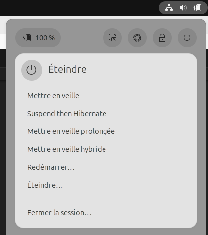

# Config ubuntu to hibernate

- <https://appsintheopen.com/posts/60-hibernate-on-ubuntu-22-04-and-24-04-without-uswsusp>

## Simple script to automate

[config_hibernation.sh](./config_hibernation.sh)